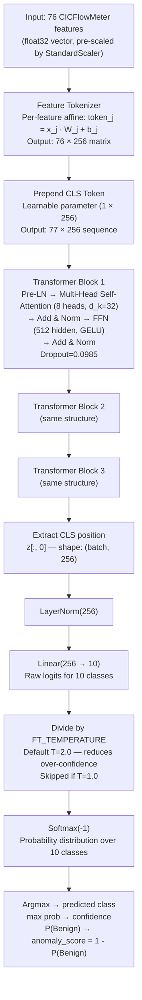

# FT-Transformer Architecture — CNDS Supervised Engine

This document describes the FT-Transformer model used as the primary supervised detection engine in CNDS. It covers the architecture, the production forward pass, the hyperparameters of the deployed checkpoint, the output label space, and the temperature scaling calibration applied at inference time.

---

## Table of Contents

1. [What is FT-Transformer?](#1-what-is-ft-transformer)
2. [Architecture Components](#2-architecture-components)
   - 2.1 [Feature Tokenizer](#21-feature-tokenizer)
   - 2.2 [CLS Token](#22-cls-token)
   - 2.3 [Transformer Encoder Blocks](#23-transformer-encoder-blocks)
   - 2.4 [Classification Head](#24-classification-head)
3. [Forward Pass Diagram](#3-forward-pass-diagram)
4. [Difference from NLP Transformers](#4-difference-from-nlp-transformers)
5. [Production Hyperparameters](#5-production-hyperparameters)
6. [Output Classes — UNSW-NB15 Label Space](#6-output-classes--unsw-nb15-label-space)
7. [Temperature Scaling Calibration](#7-temperature-scaling-calibration)
8. [Implementation Reference](#8-implementation-reference)

---

## 1. What is FT-Transformer?

FT-Transformer (Gorishniy et al., "Revisiting Deep Learning Models for Tabular Data," NeurIPS 2021) adapts the Transformer architecture to **tabular data** — rows of numeric features rather than sequences of discrete tokens.

The key insight is that each numeric feature can be treated as its own "token" by projecting it to a shared embedding dimension via a learned affine transformation (one weight vector and one bias vector per feature). Once all features are embedded into the same space, standard Transformer self-attention can let every feature attend to every other feature simultaneously. This is qualitatively different from a decision tree, which can only split on one feature threshold at a time: the attention mechanism captures joint dependencies like "high `flow_pkts_s` AND high `syn_flag_cnt` AND low `ack_flag_cnt`" in a single operation.

In CNDS, the FT-Transformer replaces the legacy Random Forest as the primary supervised classifier. It was trained jointly for ML-IDS and CNDS on the UNSW-NB15 dataset and is tuned with Optuna over architecture, regularisation, and class-imbalance strategies.

---

## 2. Architecture Components

### 2.1 Feature Tokenizer

The tokenizer converts a 76-element numeric input vector into a sequence of 76 dense vectors, one per feature. Each feature `j` is projected independently:

```
token_j = x_j * W_j + b_j
```

where `x_j` is the scalar value of feature `j`, `W_j ∈ R^{d_token}` is a learned weight vector, and `b_j ∈ R^{d_token}` is a learned bias vector. Both are `nn.Parameter` objects initialized via Kaiming uniform.

This produces a matrix of shape `(76, d_token)` — 76 tokens, each of dimension `d_token = 256`.

The tokenizer has no shared weights across features: each feature learns its own projection. This gives the model full freedom to scale and orient each feature's contribution to the attention computation independently of all others.

**Total tokenizer parameters:** `76 × 256 × 2 = 38,912` (weights + biases).

### 2.2 CLS Token

Following the BERT convention, a single learnable `[CLS]` token is prepended to the sequence of feature tokens. The CLS token is a `nn.Parameter` of shape `(1, 1, d_token)` initialized from `N(0, 0.02)`.

After prepending, the full input to the encoder is a sequence of length `76 + 1 = 77` tokens, each of dimension 256.

The CLS token is the "aggregation point": after the encoder processes the full sequence, only the representation at position 0 (the CLS slot) is passed to the classification head. The attention mechanism allows the CLS token to gather information from all 76 feature tokens across multiple layers.

### 2.3 Transformer Encoder Blocks

The encoder consists of `n_blocks = 3` stacked `nn.TransformerEncoderLayer` blocks, each with the following configuration:

| Parameter | Value | Notes |
|---|---|---|
| `d_model` | 256 | Token dimension |
| `nhead` | 8 | Number of attention heads (head_dim = 256/8 = 32) |
| `dim_feedforward` | 512 | FFN hidden dimension = `d_token × ff_factor` = 256 × 2.0 |
| `dropout` | 0.0985 | Applied to attention weights and FFN activations |
| `activation` | GELU | Smooth non-linearity (better than ReLU on tabular data) |
| `batch_first` | True | Input shape is `(batch, seq_len, d_model)` |
| `norm_first` | True | **Pre-LN** layout: LayerNorm before attention and FFN |

**Pre-LN layout** (norm_first=True) means each sub-layer applies LayerNorm to its input before computing attention or the FFN, rather than after. Pre-LN training is more stable than Post-LN at the cost of a small representation expressiveness trade-off.

Each block processes the full sequence of 77 tokens (CLS + 76 features) and outputs the same shape. Residual connections are applied inside `nn.TransformerEncoderLayer`.

A final `nn.LayerNorm(d_token)` is applied to the full sequence output before the classification head.

### 2.4 Classification Head

The classification head is a single `nn.Linear(d_token, n_classes)` = `Linear(256, 10)`. It receives only the representation at position 0 (the CLS token) from the normalized encoder output:

```python
return self.head(self.norm(z[:, 0]))
```

This outputs a vector of 10 raw logits, one per UNSW-NB15 class. Temperature scaling and softmax are applied outside the `nn.Module` during inference.

---

## 3. Forward Pass Diagram



**Sequence shape at each stage:**

| Stage | Shape |
|---|---|
| Raw input (post-scaler) | `(1, 76)` |
| After tokenizer | `(1, 76, 256)` |
| After CLS prepend | `(1, 77, 256)` |
| After encoder (3 blocks) | `(1, 77, 256)` |
| CLS slice | `(1, 256)` |
| After LayerNorm | `(1, 256)` |
| Logits | `(1, 10)` |
| After temperature scaling | `(1, 10)` |
| Probabilities (softmax) | `(1, 10)` |

---

## 4. Difference from NLP Transformers

| Aspect | NLP Transformer (e.g., BERT) | FT-Transformer (CNDS) |
|---|---|---|
| Input representation | Discrete token IDs → embedding lookup table | Continuous scalar features → per-feature affine projection |
| Sequence length | Hundreds to thousands of word tokens | Fixed 76 (one per numeric feature) + 1 CLS = 77 |
| Token meaning | Semantic units (words, sub-words) | Network traffic statistics (flow duration, packet rate, etc.) |
| Positional encoding | Required (word order matters) | Not used (feature order is fixed by the dataset schema) |
| Pre-training | Large-scale unsupervised pre-training | Trained from scratch on UNSW-NB15 in supervised mode |
| Vocabulary size | 30k–50k tokens | No vocabulary — each of the 76 features has its own 256-dim projection |
| Output | Next-token prediction, masked-token reconstruction | 10-class classification of network flows |

The core Transformer mechanism (scaled dot-product attention, multi-head projection, FFN with residual connections) is identical. What changes is how the input is mapped to the token sequence and what the output represents.

In the tabular setting, "attention over tokens" means "attention over features": the model learns which pairs of flow statistics co-vary in ways diagnostic of each attack class, without needing to specify those co-variations manually.

---

## 5. Production Hyperparameters

The checkpoint deployed at `models/unified/unified_ft_transformer.pt` was produced by an Optuna sweep (25 trials, TPESampler + MedianPruner) over the joint ML-IDS + CNDS training set. The values below are read directly from the checkpoint's `config` key and are authoritative. **Note:** `models/unified/unified_metadata.json` contains stale values from an earlier trial (`d_token=128`); the checkpoint file itself is the source of truth.

```python
{
    # Architecture
    'd_token':      256,     # Embedding dimension per feature and CLS token
    'n_blocks':     3,       # Number of Transformer encoder blocks
    'n_heads':      8,       # Attention heads per block (head_dim = 32)
    'ff_factor':    2.0,     # FFN hidden dim = d_token × ff_factor = 512

    # Regularisation
    'dropout':      0.0985,  # Dropout rate (attention weights + FFN activations)

    # Optimisation
    'lr':           3.9e-4,  # AdamW learning rate
    'weight_decay': 7.15e-5, # AdamW weight decay (L2 regularisation)
    'batch_size':   2048,    # Training batch size

    # Class imbalance
    'class_weight': 'sqrt_inverse',  # w_j = sqrt(N / (n_classes × count_j))
    'use_focal':    False,   # Focal loss adds nothing over sqrt-weighted CE on this dataset
}
```

**Training summary:**

| Metric | Value |
|---|---|
| Dataset | UNSW-NB15 (CIC redistribution), 76 CICFlowMeter features |
| Train / Val / Test split | 313,539 / 67,188 / 67,188 flows |
| Best validation epoch | 35 (of 50 max, patience=10) |
| Validation F1 macro (best) | 0.5387 |
| **Test F1 macro** | **0.6197** |
| Test F1 weighted | 0.9380 |
| XGBoost baseline (test F1 macro) | 0.6095 |
| Default FT-T (no Optuna, test F1 macro) | 0.5446 |
| Total parameters | ~2.4M |
| Training hardware | NVIDIA GeForce RTX 5060 Ti |
| Training time | ~686 s |

The +1.0 pp macro F1 gain over XGBoost comes primarily from minority classes: Backdoor (0.44 → 0.58), Generic (0.65 → 0.75), Worms (0.34 → 0.46). These are classes where joint-feature attention — rather than single-feature splits — provides a stronger signal.

---

## 6. Output Classes — UNSW-NB15 Label Space

The model head produces 10 logits. The corresponding class labels (exposed as `UNIFIED_CLASS_LABELS` in `src/models/ft_transformer.py`) are:

| Class ID | Label | UNSW-NB15 Attack Category |
|---|---|---|
| 0 | Benign | Normal traffic |
| 1 | Analysis | Deep packet inspection / protocol-level attacks |
| 2 | Backdoor | Backdoor implants and Remote Access Trojan (RAT) traffic |
| 3 | DoS | Denial-of-Service (any mechanism) |
| 4 | Exploits | Active exploitation of software vulnerabilities |
| 5 | Fuzzers | Random/semi-random input fuzzing |
| 6 | Generic | Generic attack patterns not fitting a specific category |
| 7 | Reconnaissance | Network scanning and host discovery |
| 8 | Shellcode | Traffic carrying or triggering shellcode injection |
| 9 | Worms | Self-propagating malware traffic |

**Training set distribution (class counts):**

| Class | Count | Fraction |
|---|---|---|
| Benign (0) | 250,832 | 80.0% |
| Exploits (4) | 21,665 | 6.9% |
| Fuzzers (5) | 20,729 | 6.6% |
| Reconnaissance (7) | 11,715 | 3.7% |
| DoS (3) | 3,127 | 1.0% |
| Generic (6) | 3,242 | 1.0% |
| Shellcode (8) | 1,472 | 0.5% |
| Backdoor (2) | 316 | 0.1% |
| Analysis (1) | 269 | 0.1% |
| Worms (9) | 172 | 0.05% |

The `sqrt_inverse` class weighting (`w_j = sqrt(N / (n_classes × count_j))`) was chosen because the full inverse weighting over-corrects for the rarest classes and reduces overall macro F1, while focal loss provides no improvement over sqrt-weighted cross-entropy on this distribution.

---

## 7. Temperature Scaling Calibration

### Why calibration is needed

Transformer classifiers trained with cross-entropy tend to produce **over-confident softmax probabilities**: the top-class probability saturates near 1.0 for a large fraction of inputs, even for ambiguous examples. Without calibration, the supervised engine would dominate the ensemble score on almost every flow, regardless of what the Isolation Forest, LSTM, or Rules Engine are reporting.

### Mechanism

Temperature scaling divides the raw logits by a scalar `T` before applying softmax:

```python
if self._temperature != 1.0:
    logits = logits / self._temperature   # applied inside _forward()
probs = logits.softmax(-1)
```

This is applied **inside `FTTransformerEngine._forward()`**, before the probabilities are returned to the ensemble. The effect is:

- `T = 1.0`: No change (softmax on raw logits).
- `T > 1.0`: Divides logits by T, making them smaller, which flattens the softmax output. The highest-probability class loses probability mass that is redistributed to other classes. Over-confidence decreases.
- `T < 1.0`: Amplifies logits, sharpening the softmax. Not recommended for this model.

At the production default of `T = 2.0`, the observed maximum class probability drops from ~0.97 to approximately ~0.85 on typical attack flows. The score fed to the ensemble is therefore more proportional to actual confidence.

### Configuration

The temperature is set via the `FT_TEMPERATURE` environment variable (validated at startup in `src/config.py`, range `[0.1, 10.0]`):

```bash
FT_TEMPERATURE=2.0   # default — reduces over-confidence
FT_TEMPERATURE=1.0   # disable temperature scaling
```

### Relationship to ensemble-level calibration

`FT_TEMPERATURE` operates at the **model output level** — it calibrates the probability distribution before the anomaly score `1 - P(Benign)` is computed. This is distinct from `CALIBRATION_TEMPERATURE`, which applies Platt scaling to the **ensemble score** (the weighted average of all four engine scores). Normally only `FT_TEMPERATURE` needs adjustment; `CALIBRATION_TEMPERATURE` should remain at 1.0 unless the entire ensemble is miscalibrated.

---

## 8. Implementation Reference

| File | Role |
|---|---|
| `src/models/ft_transformer.py` | `FTTransformer` nn.Module, `load_checkpoint`, `build_from_checkpoint`, `UNIFIED_CLASS_LABELS` |
| `src/engines/ft_transformer_engine.py` | `FTTransformerEngine`: load (MLflow → local), scale, forward pass, temperature, `predict` / `anomaly_score` |
| `src/config.py` | `FT_TEMPERATURE`, `FT_MODEL_PATH`, `FT_SCALER_PATH`, `FT_USE_GPU`, `FT_SCORE_THRESHOLD`, `MLFLOW_FT_REGISTRY_NAME` |
| `models/unified/unified_ft_transformer.pt` | Checkpoint bundle: `state_dict`, `config`, `n_features`, `n_classes`, `feature_names` |
| `models/unified/unified_scaler.pkl` | `sklearn.preprocessing.StandardScaler` fitted on the training split |
| `models/unified/unified_metadata.json` | Hyperparameters, metrics, training history, class counts |
| `scripts/smoke_test_ft_unified.py` | Reproduces test F1 macro on the held-out 15% split (~0.6194) |
| `tests/test_ft_transformer_engine.py` | 7 integration tests: load, scale, forward, softmax, benign/attack prediction |
| `doc/UNIFIED_FT_LIVE_RUNBOOK.md` | Manual end-to-end test with hping3 / nmap on live traffic |
